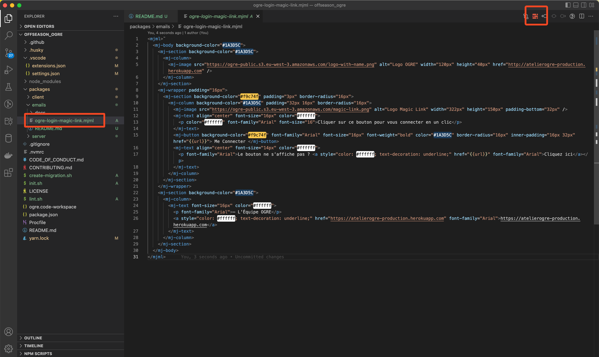
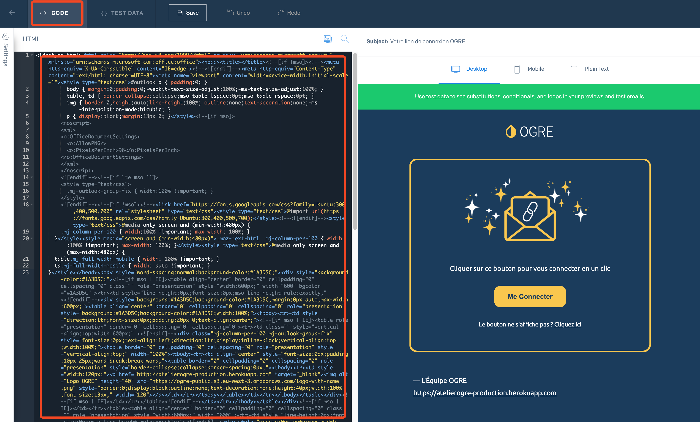

# Emails

Emails are developed using mjml to ensure compatibility across mail clients.

🔗 [MJML Documentation](https://documentation.mjml.io/)

## Setup

1. Install the vscode extension `mjmlio.vscode-mjml`

1. Open a `mjml` file and render the email by clicking on the top right mjml icon

  

## Deploy to Sendgrid

1. Open the `mjml` file to deploy and convert & copy the html with the vscode command `MJML: Copy HTML`

1. Connect to Sendgrid and open the page `Email API > Dynamic Templates`. Select/Create the dynamic template to modify

1. In the code section, paste the html and save the modifications

  

## Caveats

Atm there is no automatic linting when saving a `mjml` file. To beautify the file, run the vscode command `MJML: Beautify`.